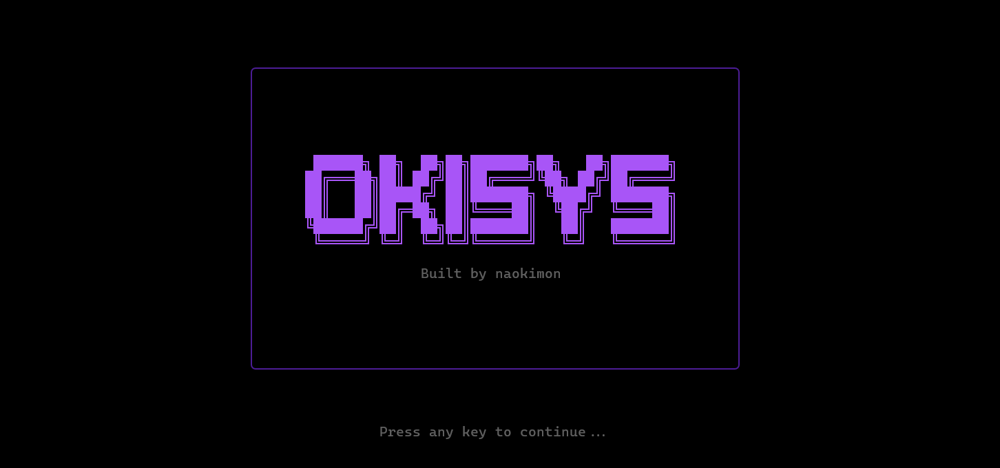

# OkiSys

A terminal-based system dashboard built with [Ink](https://github.com/vadimdemedes/ink).



## Usage

```bash
npx okisys
```

Or install globally:

```bash
npm install -g okisys
okisys
```

Requires Node.js 18 or higher.

## What it shows

- **System Specs** — CPU, GPU model/VRAM/driver, RAM (type/speed/slots), storage, OS, hostname, architecture
- **Performance** — live CPU, RAM, and GPU usage with progress bars, refreshed every 5 seconds
- **Network** — interface name/type/IPv4/status, download/upload speed, internet latency
- **Command List** — available commands at a glance

## Commands

| Command | Description |
|---|---|
| `goto <url>` | Open a URL in your browser (adds `https://` if missing) |
| `search <query>` | Search Google in your browser |
| `github <username>` | Open a GitHub profile (shows error if user doesn't exist) |
| `time` | Show the current time |
| `clear` | Clear the output |
| `okisys` | Open the OkiSys repository on GitHub |
| `exit` | Quit |

Use the **up/down arrow keys** to cycle through command history. History is saved to `~/.okisys_history`.

## Development

```bash
npm run dev
```

To build the distributable bundle:

```bash
npm run build
```
